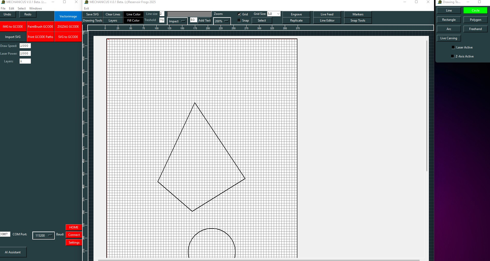

# Mechanicus CAD - Laser/CNC Design System



A modern, web-based CAD system for laser engraving and CNC machines. Design, edit, and control your laser/CNC projects directly from your browser with real-time machine communication.

## 🎯 What It Can Do

### Drawing & Design
- **Professional Drawing Tools**: Line, Circle, Rectangle, Polygon, Arc, and Freehand drawing
- **Advanced Line Editing**: Fillet, Chamfer, Trim, Extend, and Adjust operations
- **Text & Fonts**: Add text with custom fonts, convert to paths for engraving
- **Transform Tools**: Scale, Mirror, Clone, and Rotate shapes with precision
- **Snap System**: Grid, Endpoint, Midpoint, and Center snapping for accurate positioning
- **Layer Management**: Organize designs with multiple layers, visibility, and locking

### File Operations
- **SVG Import/Export**: Full layer organization support
- **Image Import**: Import PNG/JPEG for tracing or engraving (planned)
- **G-code Generation**: Convert designs to machine-ready G-code
- **Undo/Redo**: Complete history with keyboard shortcuts (Ctrl+Z, Ctrl+Y)

### Machine Control
- **Direct Machine Communication**: Connect to GRBL, Marlin, and Smoothieware machines
- **Real-time Position Tracking**: Live machine position updates on canvas
- **Jog Controls**: Precise manual control with speed and step size settings
- **G-code Transmission**: Line-by-line sending with progress tracking
- **Multiple Firmware Support**: Auto-detection of GRBL, Marlin, and Smoothieware

### User Features
- **Authentication System**: Secure user accounts with JWT tokens
- **Workspace Persistence**: Auto-save/restore your workspace layout
- **Responsive Dark Theme**: Professional UI optimized for long sessions
- **Floating Panel System**: Customizable tool windows that stack on the right side

## 🚀 Installation

### Prerequisites
- Node.js 18 or higher
- npm or yarn package manager
- PostgreSQL database (for production) or use the included Replit database

### Step 1: Clone the Repository
```bash
git clone https://github.com/JoeSzeles/Mechanicus_Laser_GRBL.git
cd Mechanicus_Laser_GRBL
```

### Step 2: Install Dependencies

#### Install Main Application Dependencies
```bash
npm install
```

#### Install Frontend Dependencies
```bash
cd frontend
npm install
cd ..
```

#### Install Companion App Dependencies
```bash
cd companion-app
npm install
cd ..
```

### Step 3: Database Setup
```bash
# Push database schema
npm run db:push
```

### Step 4: Environment Variables
Create a `.env` file in the root directory (optional, defaults work for local development):
```env
DATABASE_URL=your_postgresql_connection_string
JWT_SECRET=your_secret_key
PORT=3001
```

## 🎮 Running the Application

### Development Mode (Recommended)

#### Option 1: Run Everything Together
```bash
npm run dev
```
This starts both backend (port 3001) and frontend (port 5000) concurrently.

#### Option 2: Run Separately
**Terminal 1 - Backend:**
```bash
npm run server
```

**Terminal 2 - Frontend:**
```bash
npm run frontend
```

### Production Mode
```bash
# Build the application
npm run build

# Start production server
npm start:prod
```

### Access the Application
- **Web App**: http://localhost:5000
- **Backend API**: http://localhost:3001

## 🔧 Running the Companion App

The Companion App is required for direct serial communication with your CNC/laser machine. It runs locally on your computer to bridge the web application with your hardware.

### Step 1: Navigate to Companion App
```bash
cd companion-app
```

### Step 2: Install Dependencies (if not done)
```bash
npm install
```

### Step 3: Start the Companion App
```bash
npm start
```

**For development with auto-restart:**
```bash
npm run dev
```

### Step 4: Access the Companion Dashboard
The companion app will automatically open in your browser at:
- **Dashboard**: http://localhost:8008
- **WebSocket Server**: ws://localhost:8080

### Companion App Features
- **Serial Port Management**: Connect/disconnect from COM ports
- **Auto-Scan**: Automatically detect available ports and firmware
- **Connection Dashboard**: Web interface to manage connections
- **Real-time Logging**: Monitor all communication with SSE streaming
- **Session Authentication**: Secure JWT-based session management
- **Multiple Firmware Support**: GRBL, Marlin, Smoothieware auto-detection

### Companion App Configuration
The companion app stores configuration in:
```
~/.config/.mechanicus-companion/config.json
```

Configuration includes:
- Paired origins (approved web app connections)
- Wildcard settings for Replit deployments
- Last connected ports and settings

## 🖥️ Using the Application

### First Time Setup
1. **Create an Account**: Click "Sign up" and create your user account
2. **Login**: Use your credentials to access the CAD interface
3. **Connect to Machine** (Optional):
   - Start the Companion App on your local machine
   - Click the Machine Settings icon in the top toolbar
   - Enter COM port and baud rate (or use Auto-Scan)
   - Click "Connect" to establish serial connection

### Drawing Your First Design
1. Open the **Drawing Tools** panel (default open on right side)
2. Select a tool (Line, Circle, Rectangle, etc.)
3. Click and drag on the canvas to create shapes
4. Use **Snap Tools** for precision placement
5. Organize with **Layers** panel
6. Adjust properties in **Shape Properties** panel

### Sending to Machine
1. Create your design using drawing tools
2. Click "Export G-code" to generate machine code
3. Use **Jog Controls** to position the machine
4. Click "Engrave" to start the job
5. Monitor progress in real-time

### Keyboard Shortcuts
- **Ctrl+Z**: Undo
- **Ctrl+Y**: Redo
- **Delete**: Delete selected shapes
- **Space+Drag**: Pan canvas
- **Mouse Wheel**: Zoom in/out

## 📁 Project Structure

```
Mechanicus_Laser_GRBL/
├── frontend/              # React/Vite web application
│   ├── src/
│   │   ├── components/   # UI components
│   │   ├── contexts/     # React contexts
│   │   ├── store/        # Zustand state management
│   │   └── utils/        # Utility functions
├── server/               # Node.js/Express backend
│   ├── db.ts            # Database connection
│   ├── index.ts         # Main server file
│   └── storage.ts       # File storage utilities
├── companion-app/        # Local serial bridge application
│   ├── src/
│   │   ├── index.js     # Main companion server
│   │   ├── logger.js    # Logging system
│   │   └── sessionManager.js
│   └── public/          # Dashboard UI
├── shared/              # Shared TypeScript schemas
└── docs/                # Documentation
```

## 🛠️ Technology Stack

### Frontend
- **React 19** - UI framework
- **Vite** - Build tool and dev server
- **Fabric.js** - Canvas drawing library
- **Zustand** - State management
- **Axios** - HTTP client

### Backend
- **Node.js + Express** - Server framework
- **TypeScript** - Type safety
- **Drizzle ORM** - Database ORM
- **PostgreSQL** - Database
- **JWT** - Authentication
- **WebSocket** - Real-time communication

### Companion App
- **Node.js + Express** - HTTP server
- **ws** - WebSocket library
- **serialport** - Serial communication
- **Server-Sent Events** - Real-time log streaming

## 🔒 Security

- **JWT Authentication**: Secure token-based authentication with 2-hour expiry
- **Password Hashing**: bcrypt with salt rounds
- **CORS Protection**: Restricted origins for API access
- **Session Management**: Companion app uses 2-minute session tokens
- **Origin Validation**: Companion app validates all WebSocket connections

## 🐛 Troubleshooting

### Companion App Won't Connect
1. Ensure companion app is running (`npm start` in companion-app folder)
2. Check that port 8080 is not blocked by firewall
3. Verify the correct URL: `ws://localhost:8080`

### Serial Port Not Found
1. Install USB/serial drivers for your device
2. Check COM port in Device Manager (Windows) or `ls /dev/tty*` (Linux/Mac)
3. Ensure no other application is using the port
4. Try different baud rates (common: 115200, 250000)

### Machine Not Responding
1. Verify correct baud rate in machine settings
2. Check machine is powered on and connected
3. Use Auto-Scan to detect firmware automatically
4. Send test command (`?` for GRBL, `M115` for Marlin)

### Database Connection Issues
1. Verify DATABASE_URL in .env file
2. Ensure PostgreSQL is running
3. Run `npm run db:push` to sync schema

## 📚 Documentation

Detailed documentation is available in the `/docs` folder:
- [Companion App Guide](docs/COMPANION_APP.md)
- [Jog Controls](docs/JOG_CONTROLS.md)
- [Machine Position Tracker](docs/MACHINE_POSITION_TRACKER.md)
- [Implementation Plan](docs/IMPLEMENTATION_PLAN.md)

## 🤝 Contributing

Contributions are welcome! Please feel free to submit pull requests or open issues for bugs and feature requests.

## 📄 License

MIT License - See LICENSE file for details

## 🙏 Acknowledgments

- Original Python Mechanicus application by Reservoir Frogs
- Built with modern web technologies for cross-platform compatibility
- Inspired by professional CAD systems with maker-friendly simplicity

---

**Enjoy creating with Mechanicus CAD!** 🎨⚡

For support and questions, please open an issue on GitHub.
